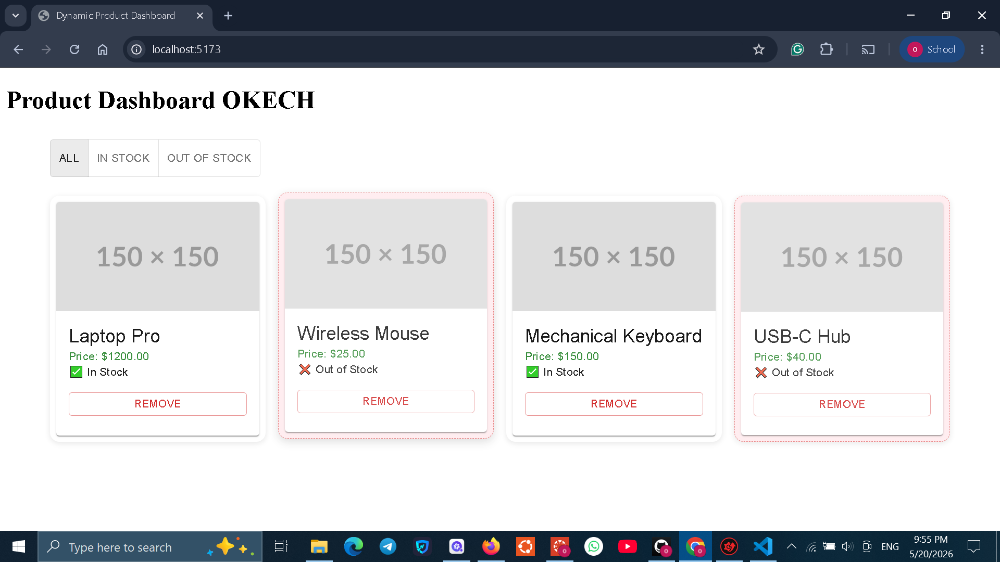

# Lab Product Dashboard

A modern React dashboard for displaying and managing product cards. This project is built with Vite, React, React Router, and Material UI, with a local mock backend served from `db.json` using `json-server`.

## 🚀 Project Overview

- React app scaffolded with Vite
- Product dashboard UI with reusable card components
- Mock API backend through `json-server`
- ESLint support for code quality
- Test setup using Vitest and React Testing Library

## 📁 Key Files

- `src/` — React source code
- `src/components/` — UI components like `ProductCard` and `ProductList`
- `db.json` — Mock dataset for local API responses
- `package.json` — Scripts and dependencies
- `vite.config.js` — Vite configuration

## ✅ Prerequisites

- Node.js 18+ installed
- npm or Yarn installed

## 📦 Install Dependencies

From the project root:

```bash
npm install
```

Or with Yarn:

```bash
yarn install
```

## 🔧 Run Locally

Start the React development server:

```bash
npm run dev
```

Open the address shown in the terminal, usually `http://localhost:5173`.

## 🧪 Mock Backend

Start the local JSON API server:

```bash
npm run server
```

The mock API will run at `http://localhost:4000`.

## 🧩 Available Scripts

- `npm run dev` — Start Vite dev server
- `npm run build` — Build production assets
- `npm run preview` — Preview production build locally
- `npm run server` — Launch `json-server` on port 4000
- `npm run lint` — Run ESLint
- `npm run test` — Run tests with Vitest
- `npm run test:watch` — Run tests in watch mode

## 💡 Notes

- Run `npm run server` before calling the mock API endpoints from the app.
- Use `npm run preview` to verify the production build locally.

---

Built for the Lab Product Dashboard Vite project.


# NOTE
i have added an image folder to show how the Product Dashboard  looks like


